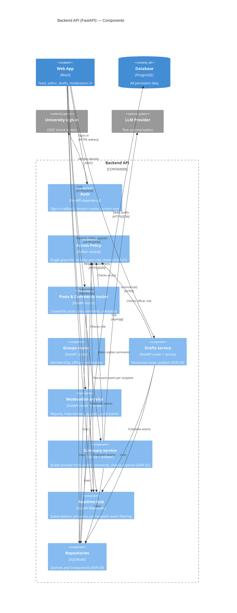

# 2.2 C4 — Level 3: Components of the Backend API

> Lead: Makar (backend component diagram, as assigned in the brief). Selected container:
> **Backend API** — it holds every rule the requirements care about (authorization,
> validation, moderation, concurrency, AI checks), so it is the container most worth
> decomposing.

## Responsibilities
| Component | Responsible for | Not responsible for |
|---|---|---|
| Auth | Turning the identity provider's answer into a session; rejecting non-university emails (FR-11) | Deciding what a user may see |
| Access Policy | Every "may this user see/do this?" decision (FR-4, FR-6, FR-14, NFR-10) | Storing data |
| Posts & Comments router | Request validation (Pydantic), creating/listing posts and comments | Visibility rules (asks Access Policy) |
| Groups router | Membership, officer appointment, verification (FR-9, FR-12) | — |
| Drafts service | Version check on save, conflict response with latest draft, publish (FR-7, NFR-8) | Live presence (Realtime hub) |
| Moderation service | Reports, hide/remove, appeals, writing moderation and audit rows in one transaction (NFR-5, NFR-12) | — |
| Summary service | Selecting visible comments, calling the LLM adapter, dropping uncited points (FR-8, FR-15) | Choosing the model vendor (adapter config) |
| Realtime hub | WebSocket connections, subscriptions, presence, delivering events (FR-13, NFR-4) | Accepting writes — all writes go through REST |
| Repositories | SQL queries, transactions, optimistic-lock `UPDATE` | Business rules |

The proof of concept (`backend/main.py`) contains a minimal version of the Posts router
only: Pydantic validation and an in-memory list in place of Repositories.
