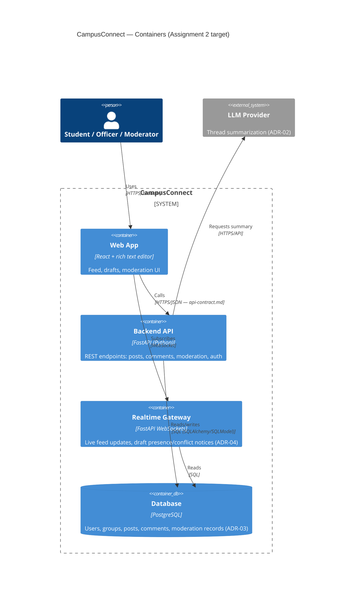
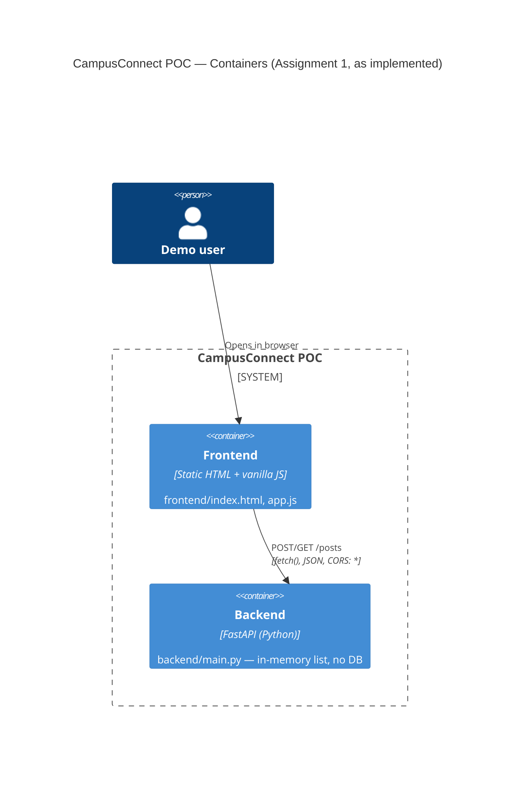

# C4 — Level 2: Containers

Assignment 2 target architecture. The Assignment 1 POC only implements the Browser SPA
(plain HTML/JS here, not React yet) and the API container (in-memory, not Postgres) —
see README "POC simplifications".

## Assignment 1 POC container view (what actually runs today)

