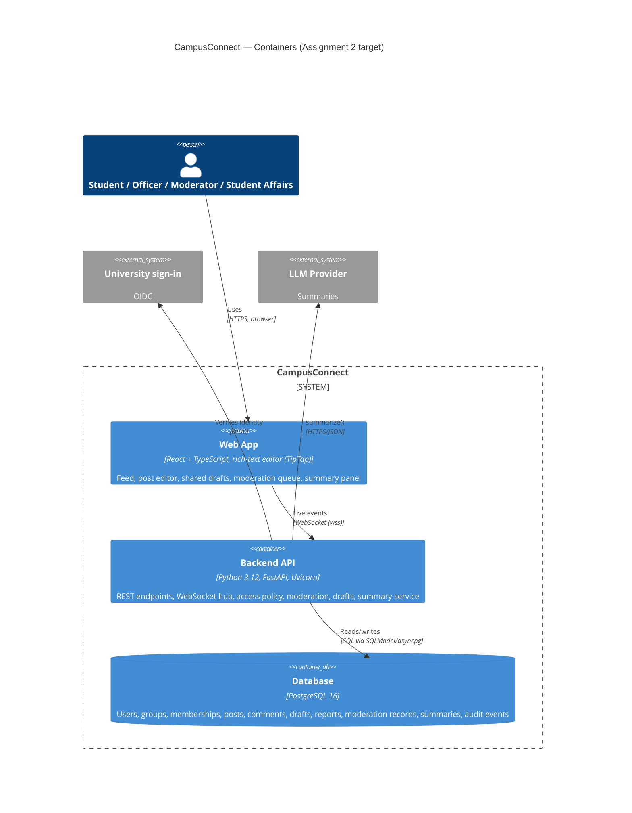

# 2.2 C4 — Level 2: Containers

> Lead: Omar, backend details from Makar.

## Assignment 2 target

### Explanation
- **Web App** — single-page React app served as static files. Only renders and sends
  requests; it holds no secrets and makes no access decisions.
- **Backend API** — one FastAPI application serving REST and WebSocket endpoints. Its
  internal structure is in `c4-component.md`.
- **Database** — PostgreSQL, the only place state is kept (ADR-03). The API process is
  stateless apart from open WebSocket connections, so it can be restarted (NFR-3, NFR-9).
- **Communication:** HTTPS/JSON for all writes and reads, WebSocket only for push
  notifications, SQL between API and database. External calls go out only from the API.

### Technology choices and Assignment 2 constraints
| Choice | Why | Assignment 2 constraint it meets |
|---|---|---|
| FastAPI | Async, Pydantic validation, built-in WebSockets and OpenAPI export; same framework as the POC | Python/FastAPI backend with WebSockets |
| WebSocket hub inside the API (not a separate service) | One deployable unit at pilot scale; shares the Access Policy code directly. If it must scale out, add Redis pub/sub between API instances | WebSockets |
| React + TipTap | Accessible, extensible rich-text editor that outputs structured JSON we can sanitise server-side | React frontend with rich text |
| PostgreSQL | Relational data with constraints and transactions (ADR-03) | — |
| LLM behind an adapter with a mock | Swap providers, test without paid calls, check citations (ADR-02) | LLM integration |

## Assignment 1 proof of concept (what runs today)

The POC keeps the same frontend/backend split and the same contract style as the target,
but replaces React with plain JavaScript and PostgreSQL with an in-memory list (see `docs/poc.md`).
