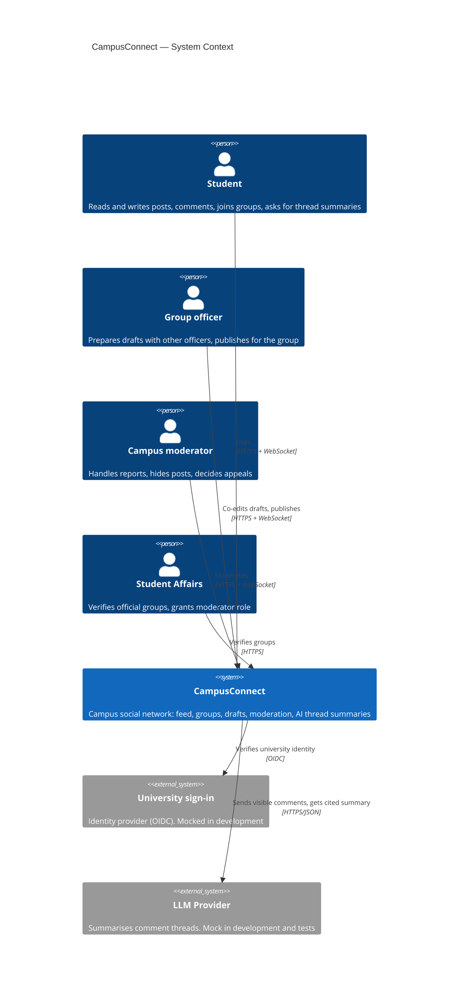

# 2.2 C4 — Level 1: System Context

> Lead: Omar. Editable Mermaid source; renders on GitHub and in `Report.pdf`.

## Explanation
- **System boundary:** CampusConnect is the only system we build. Everything inside it is
  shown in the container diagram.
- **Users:** the four human stakeholder groups from `stakeholders.md` (S1–S4). The bad
  actor (S5) is not drawn as a user; the design defends against them through identity
  (FR-11) and authorization (ADR-01).
- **External systems:** the university identity provider, so only university accounts can
  sign in (FR-11), and an LLM provider for thread summaries (FR-8). Both sit behind backend
  adapters, so mocks replace them in development and in the POC — no paid calls needed.
- **Communication:** browsers use HTTPS for requests and a WebSocket for live updates; only
  the backend talks to the external systems, so no secret reaches the browser.
