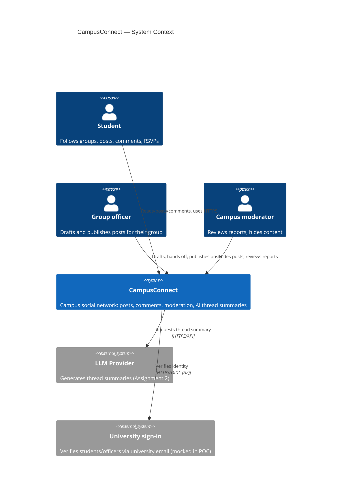

# C4 — Level 1: System Context

Editable source (Mermaid) — renders directly on GitHub.

```mermaid
C4Context
    title CampusConnect — System Context

    Person(student, "Student", "Follows groups, posts, comments, RSVPs")
    Person(officer, "Group officer", "Drafts and publishes posts for their group")
    Person(moderator, "Campus moderator", "Reviews reports, hides content")

    System(campusconnect, "CampusConnect", "Campus social network: posts, comments, moderation, AI thread summaries")

    System_Ext(llm, "LLM Provider", "Generates thread summaries (Assignment 2)")
    System_Ext(university_auth, "University sign-in", "Verifies students/officers via university email (mocked in POC)")

    Rel(student, campusconnect, "Reads/posts/comments, uses HTTPS")
    Rel(officer, campusconnect, "Drafts, hands off, publishes posts")
    Rel(moderator, campusconnect, "Hides posts, reviews reports")
    Rel(campusconnect, llm, "Requests thread summary", "HTTPS/API")
    Rel(campusconnect, university_auth, "Verifies identity", "HTTPS/OIDC (A2)")
```
