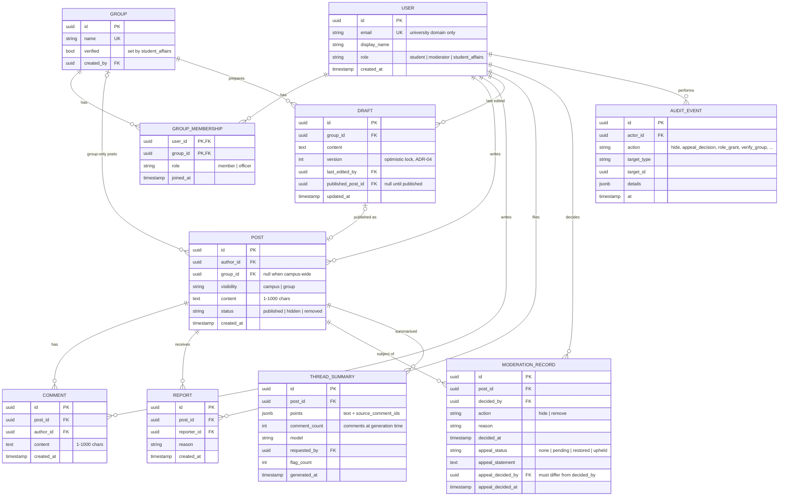

# 2.6 Data Model

> Lead: Makar. Assignment 2 target model for PostgreSQL (ADR-03). The Assignment 1 POC
> stores only an in-memory post (`id`, `author`, `content`, `created_at`, see `api-contract.md`).

## Entities
| Entity | Purpose | Requirements |
|---|---|---|
| USER | A verified university account; `role` holds global powers | FR-11, NFR-7 |
| GROUP | A club/community; `verified` drives the badge | FR-9, FR-12 |
| GROUP_MEMBERSHIP | Who belongs to which group and who is an officer there | FR-4, FR-6, FR-12 |
| POST | Published content with its audience and moderation status | FR-1, FR-2, FR-4 |
| COMMENT | Discussion under a post | FR-3 |
| DRAFT | Shared announcement being prepared by a group's officers | FR-7, NFR-8 |
| REPORT | A user's complaint about a post | FR-10 |
| MODERATION_RECORD | The decision on a post and its single appeal | FR-5, FR-6, FR-14, NFR-5 |
| THREAD_SUMMARY | Stored AI summary with its sources, so it can be checked and flagged | FR-8, FR-15 |
| AUDIT_EVENT | Append-only history of privileged actions | NFR-12 |

## Relationships
- A user belongs to many groups and a group has many users, through `GROUP_MEMBERSHIP`
  (many-to-many). Officer is a role *on the membership*, so a person can be an officer of one
  group and a plain member of another.
- A post belongs to one author and, if group-only, one group. A post has many comments,
  reports, moderation records (one per decision) and summaries (regenerated as the thread grows).
- A draft belongs to one group and becomes at most one post when published.

## Constraints (enforced in the database, not only in code)
| Constraint | Supports |
|---|---|
| `USER.email` unique; domain checked at sign-in | FR-11, S5 |
| `POST.visibility = 'group'` ⇔ `group_id IS NOT NULL` (CHECK) | FR-4, ADR-01 |
| `char_length(content) BETWEEN 1 AND 1000` on POST and COMMENT (CHECK) | FR-1, FR-3 |
| `UNIQUE (post_id, reporter_id)` on REPORT | FR-10 (no duplicate reports) |
| `appeal_decided_by <> decided_by` (CHECK) | FR-14, ADR-01 second moderator |
| `DRAFT.version` incremented only by `UPDATE … WHERE id = ? AND version = ?` | FR-7, NFR-8, ADR-04 |
| Post status change and its MODERATION_RECORD written in one transaction | NFR-5 |
| AUDIT_EVENT has no update/delete path in the API; DB role for the app has `INSERT, SELECT` only | NFR-12 |
| Foreign keys `ON DELETE RESTRICT` for moderation/audit rows | NFR-5, NFR-12 |
| Indexes on `POST(created_at)`, `POST(group_id, created_at)`, `COMMENT(post_id, created_at)` | NFR-1 |

## How the model supports the policies
- **Audience control:** the feed query joins `POST` with the caller's `GROUP_MEMBERSHIP`;
  group-only posts without a matching membership row are never selected.
- **Moderation and appeals:** hiding a post sets `POST.status = 'hidden'` but keeps the row,
  so content and reports remain available for the appeal (US-3, US-10).
- **AI checking:** `THREAD_SUMMARY.points` keeps the comment ids behind each point;
  `flag_count` records user reports of wrong summaries (FR-15).
