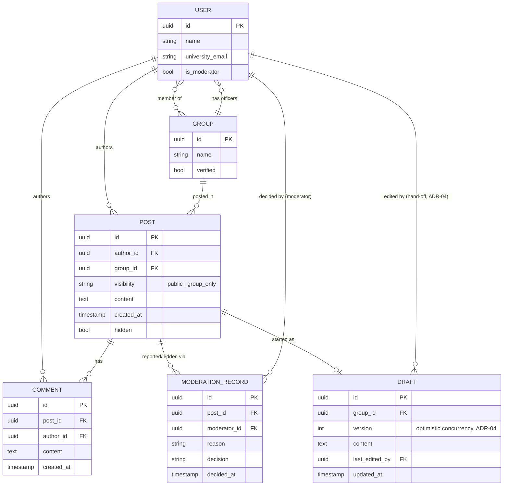

# ER Diagram

Assignment 2 target data model (PostgreSQL, ADR-03). The Assignment 1 POC only has an
in-memory `Post` shape (id, author, content, created_at) — see `api-contract.md`.

```mermaid
erDiagram
    USER ||--o{ POST : authors
    USER ||--o{ COMMENT : authors
    USER }o--o{ GROUP : "member of"
    GROUP ||--o{ POST : "posted in"
    GROUP ||--o{ USER : "has officers"
    POST ||--o{ COMMENT : has
    POST ||--o{ MODERATION_RECORD : "reported/hidden via"
    USER ||--o{ MODERATION_RECORD : "decided by (moderator)"
    POST ||--o| DRAFT : "started as"
    USER ||--o{ DRAFT : "edited by (hand-off, ADR-04)"

    USER {
        uuid id PK
        string name
        string university_email
        bool is_moderator
    }
    GROUP {
        uuid id PK
        string name
        bool verified
    }
    POST {
        uuid id PK
        uuid author_id FK
        uuid group_id FK
        string visibility "public | group_only"
        text content
        timestamp created_at
        bool hidden
    }
    COMMENT {
        uuid id PK
        uuid post_id FK
        uuid author_id FK
        text content
        timestamp created_at
    }
    MODERATION_RECORD {
        uuid id PK
        uuid post_id FK
        uuid moderator_id FK
        string reason
        string decision
        timestamp decided_at
    }
    DRAFT {
        uuid id PK
        uuid group_id FK
        int version "optimistic concurrency, ADR-04"
        text content
        uuid last_edited_by FK
        timestamp updated_at
    }
```
