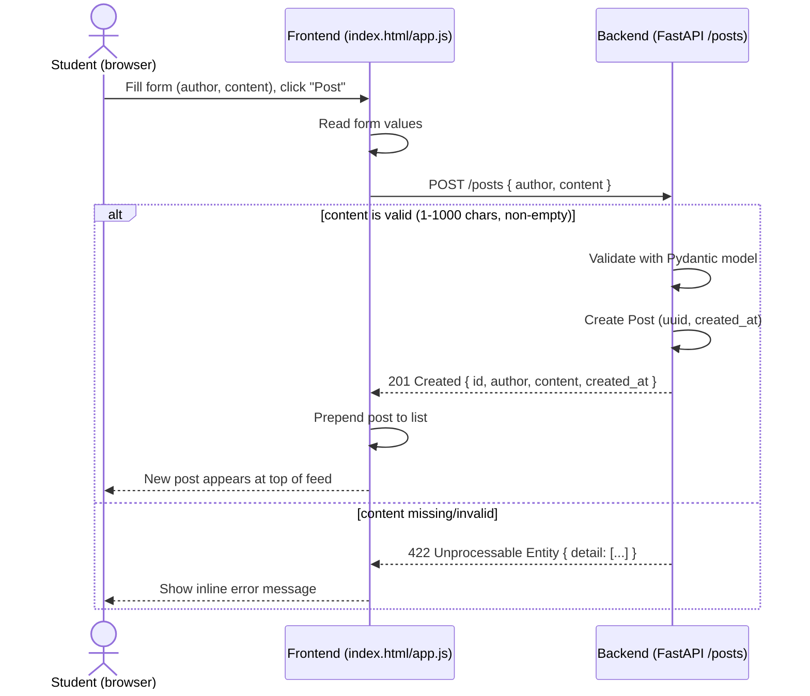

# Collaboration Sequence Diagram — Create a Post (POC demo flow)

Matches the actual POC implementation and `api-contract.md` exactly — this is the sequence
the 3-minute demo walks through.

```mermaid
sequenceDiagram
    actor U as Student (browser)
    participant FE as Frontend (index.html/app.js)
    participant API as Backend (FastAPI /posts)

    U->>FE: Fill form (author, content), click "Post"
    FE->>FE: Read form values
    FE->>API: POST /posts { author, content }

    alt content is valid (1-1000 chars, non-empty)
        API->>API: Validate with Pydantic model
        API->>API: Create Post (uuid, created_at)
        API-->>FE: 201 Created { id, author, content, created_at }
        FE->>FE: Prepend post to list
        FE-->>U: New post appears at top of feed
    else content missing/invalid
        API-->>FE: 422 Unprocessable Entity { detail: [...] }
        FE-->>U: Show inline error message
    end
```
