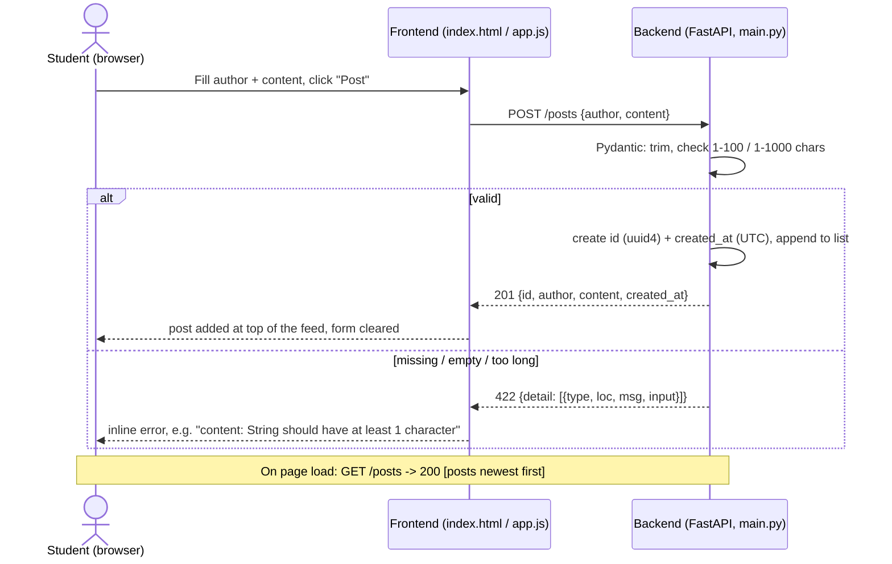

# Proof-of-Concept Sequence — Create a Post

> Lead: Omar. The single interaction implemented in Assignment 1 (Section 4) and shown in
> the demo. Matches `backend/main.py`, `frontend/app.js` and `api-contract.md` Part A.

