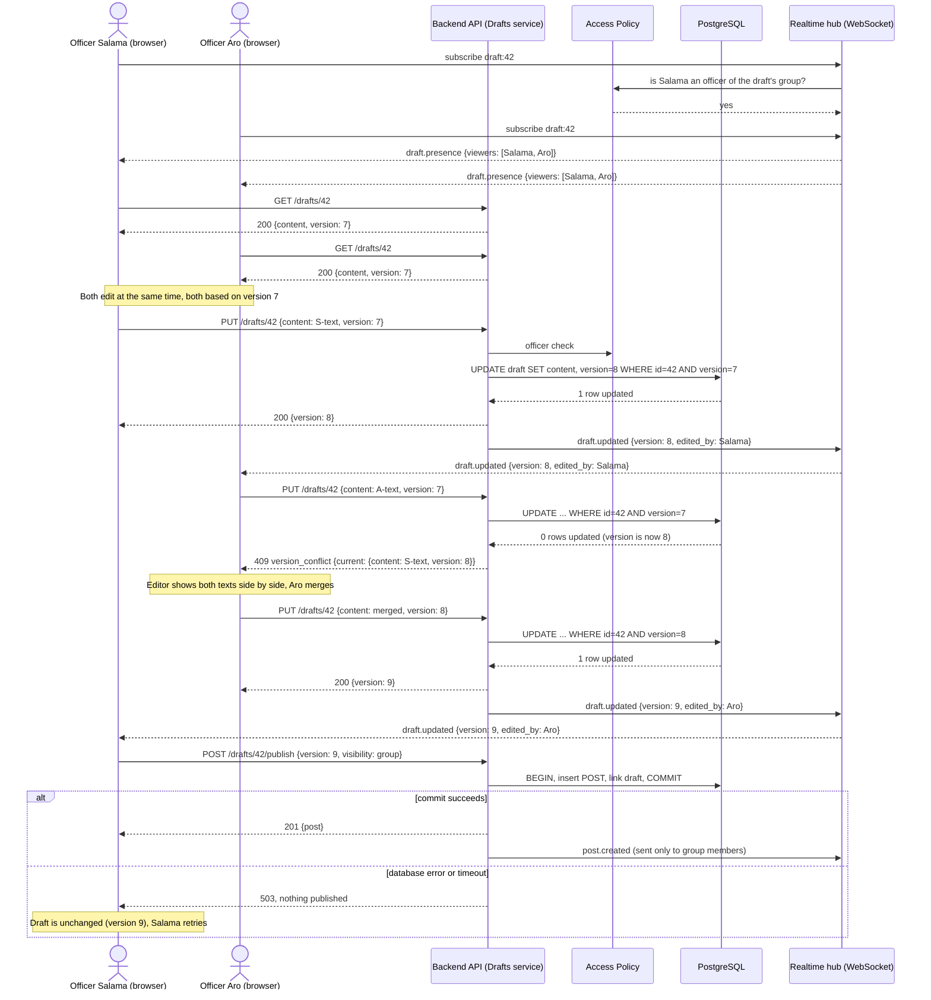

# 2.3 UML Sequence Diagram — Two Officers Co-edit and Publish a Draft

> Lead: Omar, backend steps by Makar. The collaborative interaction required by 2.3:
> officers Salama and Aro of the same group prepare one announcement (FR-7, US-8, ADR-04).

## What happens when users act concurrently
- Both officers can type at the same time; nothing is locked. Saves are checked against the
  version the officer started from. The first save wins; the second gets **409** with the
  current text, so no edit is silently lost (NFR-8).
- Presence events show who else is in the draft, so most conflicts are avoided before they
  happen.
- If both press **Publish** at once, both requests carry version 9: the first creates the
  post and marks the draft published; the second gets 409 (`already published`) — the
  announcement is never posted twice.

## What happens when an operation fails
| Failure | Behaviour |
|---|---|
| WebSocket drops | Client reconnects with backoff and refetches the draft over REST; edits are never sent over the socket, so none are lost |
| Save request times out | Client keeps the text locally and retries with the same version; a duplicate is harmless because the version check rejects it (409 with the same content) |
| Database error during publish | Transaction rolls back; no post exists, draft unchanged, client gets 503 and can retry |
| Officer loses officer role mid-edit | Next save returns 403; the draft stays for the remaining officers |
| Officer opens the editor while offline | Editor is read-only until the latest version is fetched |
